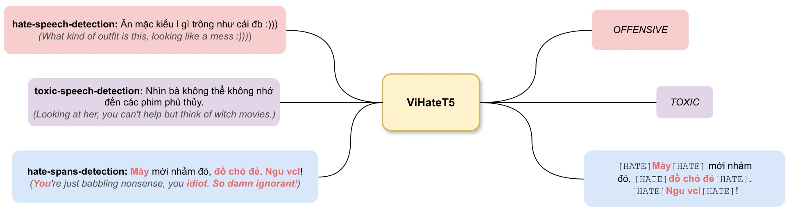

# ViHateT5: Enhancing Hate Speech Detection in Vietnamese with A Unified Text-to-Text Transformer Model
This is the official repository for the paper [ViHateT5: Enhancing Hate Speech Detection in Vietnamese with A Unified Text-to-Text Transformer Model](LINK), which was accepted at the [ACL 2024](https://2024.aclweb.org/).

```
@InProceedings{...
}
```

## Introduction


Recent advancements in hate speech detection (HSD) in Vietnamese have made significant progress, primarily attributed to the emergence of transformer-based pre-trained language models, particularly those built on the BERT architecture. However, the necessity for specialized fine-tuned models has resulted in the complexity and fragmentation of developing a multitasking HSD system. Moreover, most current methodologies focus on fine-tuning general pre-trained models, primarily trained on formal textual datasets like Wikipedia, which may not accurately capture human behavior on online platforms. In this research, we introduce ViHateT5, a T5-based model pre-trained on our proposed large-scale domain-specific dataset named VOZ-HSD. By harnessing the power of a text-to-text architecture, ViHateT5 can tackle multiple tasks using a unified model and achieve state-of-the-art performance across all standard HSD benchmarks in Vietnamese. Our experiments also underscore the significance of label distribution in pre-training data on model efficacy. We provide our experimental materials for research purposes, including the [VOZ-HSD dataset](https://huggingface.co/datasets/tarudesu/VOZ-HSD), [pre-trained checkpoint](https://huggingface.co/tarudesu/ViHateT5-base), [the unified HSD-multitask ViHateT5 model](https://huggingface.co/tarudesu/ViHateT5-base-HSD), and related source code on GitHub publicly.

## Dataset
The [VOZ-HSD dataset](https://huggingface.co/datasets/tarudesu/VOZ-HSD) consists of 10.7M+ AI-annotated comments with two labels HATE (1) and CLEAN (0) from Vietnamese users' comments on VOZ Forum. Note that the labels generated by the AI Classifier are only used for data analysis, not for fine-tuning in any downstream tasks.

## Pre-training
We follow the released code of [this repo](https://github.com/huggingface/transformers/blob/main/examples/flax/language-modeling/run_t5_mlm_flax.py) in order to pre-train the ViHateT5 on raw texts from the VOZ-HSD dataset.

## Fine-tuning
The pre-trained ViHateT5 is then fine-tuned on multiple HSD benchmark datasets, including:
1. [ViHSD](https://github.com/sonlam1102/vihsd): Vietnamese Hate Speech Detection (Labels: HATE, OFFENSIVE, and CLEAN)
2. [ViCTSD](https://huggingface.co/datasets/tarudesu/ViCTSD): Constructive and Toxic Speech Detection for Open-domain Social Media Comments in Vietnamese (TOXIC and NONE)
3. [ViHOS](https://github.com/phusroyal/ViHOS): Vietnamese Hate and Offensive Spans Detection (Hate Speech Spans)

The fine-tuned [ViHateT5-HSD](https://huggingface.co/tarudesu/ViHateT5-base-HSD) model is available on HuggingFace.

Please feel free to contact us by email luannt@uit.edu.vn if you have any further information!
